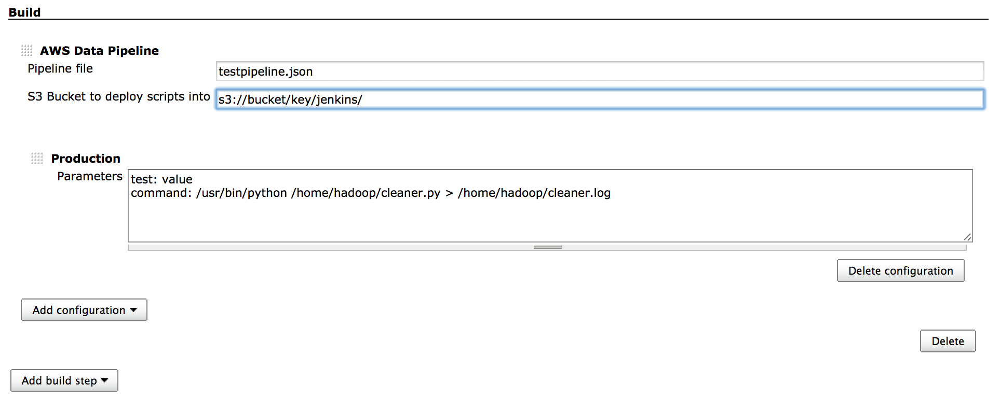

Pipeline Builder is a Jenkins plugin to help you control AWS Data Pipeline deployment.

[AWS Data Pipeline](http://aws.amazon.com/datapipeline/) is a feature of Amazon Web Services that offers a workflow tool for automating data processing. Simple jobs can be built up using the Web interface through the AWS console. But more complex data flows require team collaboration and future edits, at which point the web interface reaches the limits of its usefulness. Data pipelines can be created in pure JSON, which is advantageous, since it can be checked into version control. This plugin adds further processing to the JSON file and automates deployments through Jenkins.

## Features
- Replace tokens in your job by values (passwords, paths, etc)
- Allows multiple versions (production/development) with different values
- Deploy new versions of pipeline to AWS
- Automatically replaces previous version of the pipeline during deployment
- Lets you specify the start date for the new pipeline
- Uploads scripts and artifacts from dependent projects to S3
- Produces a graph representation of your activities and their dependencies

## Installation

1. Download *.hpi plugin file

2. Install Plugin in Jenkins

3. Configure AWS access keys
Go to "Manage Jenkins" -> "Configure System", and look for AWS Pipeline Builder section.

4. Create a Job
Under `Build` section of the configuration, add build step "AWS Data Pipeline". In the build configuration give relative path to the pipeline JSON definition file.

If you want scripts used by the pipeline to be deployed to S3 (see File references), provide the S3 path under which the scripts will be placed. The URL should be in the form `s3://bucket_name/path/`

Click "Add Configuration" and select either production or development configuration to create. In the parameters text field provide any key-value mappings to be replaced in the pipeline configuration. Please note that the configuration needs to be created even if you don't have any parameters to replace out, otherwise the pipeline will not be processed.

If you do want to use key-value replacement, place your key values as colon separated list, ex:

   
       name: Dynamo DB
       table: staging_db
  
  
See Key-value replacement below for more info.

## Pipeline syntax

You can start with the standard AWS pipeline JSON file, and make modifications to take advantage of other features of the plugin. 

### Key-Value replacement

A typical use case for having multiple configuration is to provide different paths, so that development pipeline writes output to a different location than production. To avoid several pipeline files, a key can be placed in the pipeline definition as such:
   
       {
         "id" : "DynamoDBTable_123",
         "type" : "DynamoDBDataNode",
         "schedule" : { "ref" : "Schedule_123" },
         "tableName" : "${table}",
         "name": "${name}",
       },
       
The keys for table and name would be replaced with values taken from build configuration  

### File references

If you define a key as a file name, and don't define a value for it, the pipeline build will look for files of defined name in the project directory, and save them as artifacts of the build. If the file can't be found in the current project, upstream jobs will be searched for an artifact (ex: works well for jars built by other projects). The file will then be deployed to S3 with the pipeline, and its S3 path will be inserted into the pipeline definition.

For this feature to work correctly, define the bucket under which the files will be saved in the Job configuration.

### Multiline statements

JSON syntax requires single line strings, however long SQL statements or shell commands are more readable if written on multiple lines. Writing a string in the pipeline JSON configuration in three quote marks would get converted into a single line statement when the pipeline is built. Example:

    ...
    "type": "SqlActivity",
    "script": """
      SELECT 1;
      DROP TABLE test;
    """,
    "database": {
      "ref": "RedshiftDatabaseId_123"
    }
    ...

## Deployment

Any successful build will make a "Deploy Pipeline" action available in the left column in Jenkins. The action will take you through the steps to deploy the pipeline to your AWS account. First you will be asked for the start date of the pipeline, defaulting to the scheduled date as defined in the pipeline. Once confirmed, basic steps to validate the pipeline will be done. If validation is successful, you will be given an overview of steps about to be taken against the AWS service (removal of the previous pipeline, activation of new pipeline, script deployment, etc). Once confirmed those actions are taken, with reports posted back.

Same build can be redeployed multiple times. One reason would be to perform rollback - it simply means executing deployment for a previous build.
